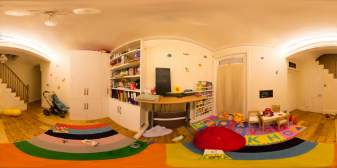

# 3D gaussian splatting

本项目在原版3D gaussian splatting的基础上，增加了从3维场景中渲染出全景图的功能。

## 环境设置

### 使用环境

```
python=3.7.1
pytorch=1.12.1
CUDA=11.8
cudatoolkit=11.6
```

代码在该环境下运行良好。

### 创建原始存储库

```
conda env create --file environment.yml
conda activate gaussian_splatting
```

## 渲染全景图

首先，需要使用原版3D gaussian splatting生成中相机位姿信息和训练所得的场景文件。

使用`convert.py`从一组图片进行COLMAP重建，获得相机位姿信息用来加载scene所用的信息。

使用`train.py`训练出相对于的场景.ply文件。

要渲染全景图，使用

```
python render_sphere.py -m <path to pre-trained model> -s <path to COLMAP dataset>
```

<details>
<summary><span style="font-weight: bold;">render_sphere.py的命令行参数</span></summary>
  #### --model_path / -m 
  要渲染的已训练模型目录的路径
  #### --sourcel_path / -s
  包含COLMAP的源目录的路径
  #### --width / -width
  渲染所得的图像宽度大小
  #### --train
  使用训练的相机位姿进行渲染
  #### --skip_test
  跳过渲染测试集
</details>
渲染后图片将保存在模型目录下。

### 渲染参数

渲染使用自定义视角进行渲染，可以在`render_sphere.py``getTestCamera()`对代码中的`qvec0`四元数、`T`偏移向量进行修改，在场景的世界坐标系基础上进行调整，渲染出想要的视角。

### 渲染结果示例

在数据集中的playroom场景中进行`render_sphere.py`渲染所得图像



## 改进

因为COLMAP进行重建出来场景世界坐标系并不在场景中心而且视角并不水平，所以相对于世界坐标系调整相机位姿并不能很好地得到如图标准的全景图，需要手动调整，仍需要改进。目前还没有很好的改进方法。